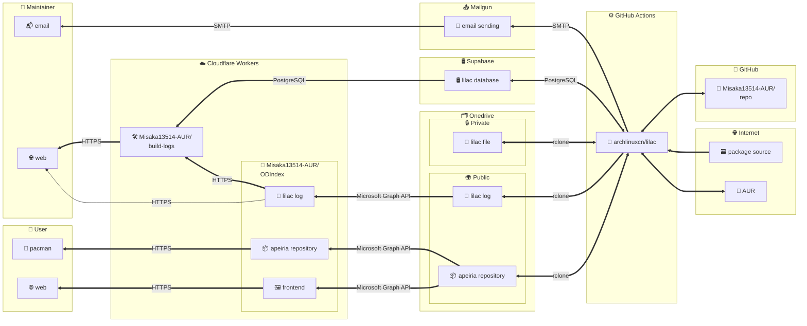

## Architecture

```mermaid
flowchart RL
  subgraph USER ["👤 User"]
    USER_PAC["🐧 pacman"]
    USER_WEB["🌐 web"]
  end

  subgraph DEV ["🧙 Maintainer"]
    DEV_MAIL["📬 email"]
    DEV_WEB["🌐 web"]
  end

  subgraph CF ["☁️ Cloudflare Workers"]
    subgraph CF_OD ["📂 Misaka13514-AUR/<br>ODIndex"]
      CF_OD_REPO["📦 apeiria repository"]
      CF_OD_DIR["🖼️ frontend"]
      CF_OD_LOG["📜 lilac log"]
    end
    CF_BUILD["🛠️ Misaka13514-AUR/<br>build-logs"]
  end

  subgraph OD ["🗂️ Onedrive"]
    subgraph OD_PUB ["🌍 Public"]
      OD_REPO["📦 apeiria repository"]
      OD_LOG["📜 lilac log"]
    end
    subgraph OD_PRIV ["🔒 Private"]
      OD_FILE["📄 lilac file"]
    end
  end

  subgraph GA ["⚙️ GitHub Actions"]
    LILAC["🤖 archlinuxcn/lilac"]
  end

  subgraph GH ["🐙 GitHub"]
    GH_REPO["📁 Misaka13514-AUR/<br>repo"]
  end

  subgraph SP ["🛢️ Supabase"]
    SP_DB["🛢️ lilac database"]
  end

  subgraph MG ["📤 Mailgun"]
    MG_MAIL["📧 email sending"]
  end

  subgraph NET ["🌐 Internet"]
    NET_SRC["🗃️ package source"]
    AUR["📁 AUR"]
  end

  %% User data flow
  OD_REPO == Microsoft Graph API ==> CF_OD_REPO
  OD_REPO == Microsoft Graph API ==> CF_OD_DIR
  CF_OD_REPO == HTTPS ===> USER_PAC
  CF_OD_DIR == HTTPS ===> USER_WEB

  %% Maintainer data flow
  OD_LOG == Microsoft Graph API ==> CF_OD_LOG
  MG_MAIL == SMTP ====> DEV_MAIL
  SP_DB == PostgreSQL ===> CF_BUILD
  CF_OD_LOG == HTTPS ==> CF_BUILD
  CF_BUILD == HTTPS ==> DEV_WEB
  CF_OD_LOG -- HTTPS --> DEV_WEB

  %% Developer data flow
  LILAC == rclone ==> OD_LOG
  LILAC <== rclone ==> OD_REPO
  LILAC <== rclone ==> OD_FILE
  LILAC <== PostgreSQL ==> SP_DB
  LILAC == SMTP ==> MG_MAIL
  GH_REPO <==> LILAC
  NET_SRC ==> LILAC
  AUR <==> LILAC
```
